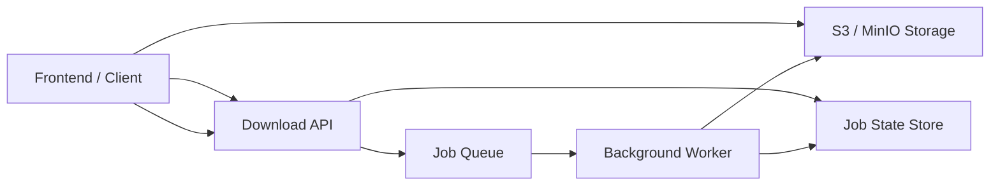

# ARCHITECTURE — Long-Running Download Service (Proxy-Safe Design)

## 1. Background & Problem Statement

This service handles file downloads that may take between **10 to 120+ seconds**.  
When deployed behind common reverse proxies such as **Cloudflare, Nginx, or Load Balancers**, long-running HTTP requests can exceed proxy or browser timeouts, resulting in **504 Gateway Timeout** errors and poor user experience.

Additionally:

- Users may close the browser tab while a download is still running
- Holding server resources for long requests does not scale well

A different architecture is required to safely handle long-running operations.

---

## 2. Design Goals

The architecture aims to:

- Avoid long-lived HTTP requests
- Remain safe behind reverse proxies
- Allow downloads to continue even if the client disconnects
- Provide visibility into download progress
- Scale reliably under load

---

## 3. Chosen Solution: Asynchronous Jobs with Polling

Instead of performing downloads inside the request lifecycle, the system uses an **asynchronous job-based approach**:

1. The client initiates a download request.
2. The API immediately responds with a **job identifier (`jobId`)**.
3. The long-running download is executed in the background.
4. The client periodically checks the job status.
5. Once completed, the result is retrieved from object storage.

This keeps all client-facing requests short and proxy-safe.

---

## 4. High-Level Architecture Diagram

## Why I Chose Option A: Polling Pattern

Polling was selected because it best fits the requirements of this project:

###  Benefits of Polling
- *Simple to implement and easy to maintain*
- *Predictable request flow* without the need for persistent connections
- *Compatible with all major hosting providers* (Vercel, Netlify, Render, etc.)
- *No real-time streaming required* — interval-based updates are sufficient
- *Great for hackathons*, prioritizing reliability, simplicity, and speed

---

###  Why Not Option B: WebSocket / SSE
- Requires *continuous open connections*, increasing server load
- Adds backend complexity: heartbeat checks, reconnection logic, scaling concerns
- Not necessary — the project is *not real-time critical*

---

###  Why Not Option C: Webhook / Callback
- Requires a *publicly accessible endpoint* to receive callbacks
- Introduces additional complexity: signature verification, retry logic, delivery tracking
- The project flow is *client-driven*, not event-driven — making webhooks a poor fit

---

###  Why Not Option D: Hybrid Approach
- Introduces unnecessary architectural complexity
- Harder to maintain and debug with *no meaningful benefit* for this use case

---

###  Conclusion
*Polling is the most practical, stable, and efficient choice for this project.*