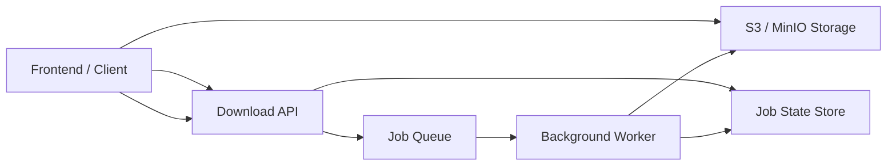

# ARCHITECTURE — Long-Running Download Service (Proxy-Safe Design)

## 1. Background & Problem Statement

This service handles file downloads that may take between **10 to 120+ seconds**.  
When deployed behind common reverse proxies such as **Cloudflare, Nginx, or Load Balancers**, long-running HTTP requests can exceed proxy or browser timeouts, resulting in **504 Gateway Timeout** errors and poor user experience.

Additionally:

- Users may close the browser tab while a download is still running
- Holding server resources for long requests does not scale well

A different architecture is required to safely handle long-running operations.

---

## 2. Design Goals

The architecture aims to:

- Avoid long-lived HTTP requests
- Remain safe behind reverse proxies
- Allow downloads to continue even if the client disconnects
- Provide visibility into download progress
- Scale reliably under load

---

## 3. Chosen Solution: Asynchronous Jobs with Polling

Instead of performing downloads inside the request lifecycle, the system uses an **asynchronous job-based approach**:

1. The client initiates a download request.
2. The API immediately responds with a **job identifier (`jobId`)**.
3. The long-running download is executed in the background.
4. The client periodically checks the job status.
5. Once completed, the result is retrieved from object storage.

This keeps all client-facing requests short and proxy-safe.

---

## 4. High-Level Architecture Diagram

